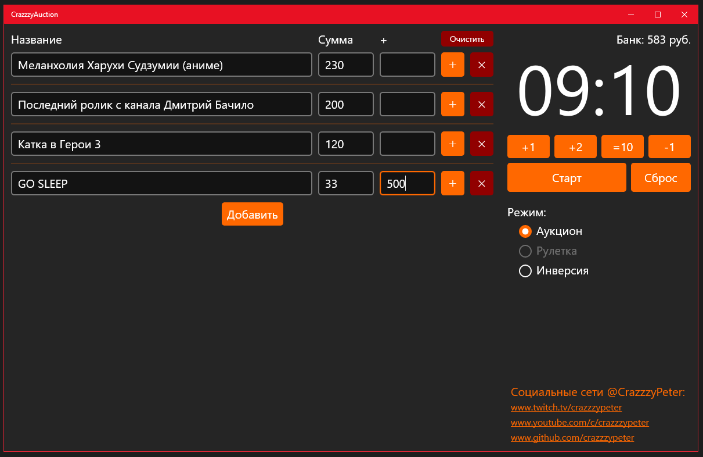
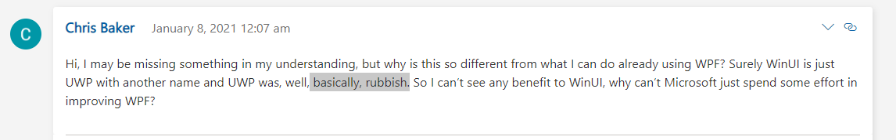

# TrashRoulette

Приложение на технологии UWP/C# для проведения мусорных аукционов, создано для использования стримерами.

*UWP - это не Win32 => скомпилированный бинарь без подписей у вас не запустится - компилируйте в Visual Studio самостоятельно!*
  
### Приложение выполнено на UWP - МУСОРНОЙ технологии от Microsoft.  
Q: Почему мусорной?  
A: https://youtu.be/iD1Yrto1v3k, https://youtu.be/8bcrAJ9FDvw
  
### Код - отстой - но по примерам от Майкрософт.  
Q: Почему такая убогая сортировка, где использование фичей биндингов как в WPF?  
(https://github.com/crazzzypeter/TrashRoulette/blob/439e863c589b36420d450068ee9bbf03e5803295/CrazzzyAuction/AuctionModel.cs#L374)  
A: В UWP биндинги "обрезаны", прототип этого кода "живой" сортировки взят где-то в примерах приложений на UWP от майков.
  
### XAML файлы разметки UI в плачевном состоянии, разметка перемешанна со стилизацией.
Q: Почему?  
A: Страшная забагованность, отсутсвие документации, смотри на тонны issues: https://github.com/microsoft/microsoft-ui-xaml/issues
  
### Код таймера ужасен
Q: !!!  
A: Я знаю :3 Дописал по быстрому, уже без интузиазма, наевшись багами UWP/WinUI 2.  

### Говнокод  
Q: !!!  
A: Не писал на C# 7 лет, и вообще не являюсь разработчиком на .Net.  
    
---

По факту UWP - уже зарыт, новое название мусорной технологии WinUI 3:
https://devblogs.microsoft.com/ifdef-windows/winui-3-preview-3/  
В этом приложении фактически используеться WinUI 2, а это - просто **КРИВАЯ** надстройка над UWP.  
Если использовать менее кривой "голый" UWP - то к сожалению приложения будут в устаревшем Windows 8 стиле.  
Таким образом при создании современных приложений на UWP/WinUI 2/3 разработчик вынужден сидеть на двух бета стульях.  

## Комментарии других разработчиков в блоге майкрософт: 
https://devblogs.microsoft.com/ifdef-windows/winui-3-preview-3

## Вывод - крайне не советую использовать UWP

